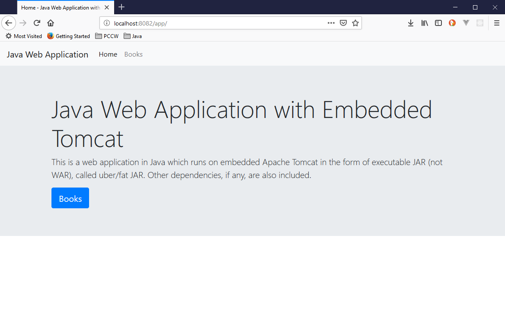
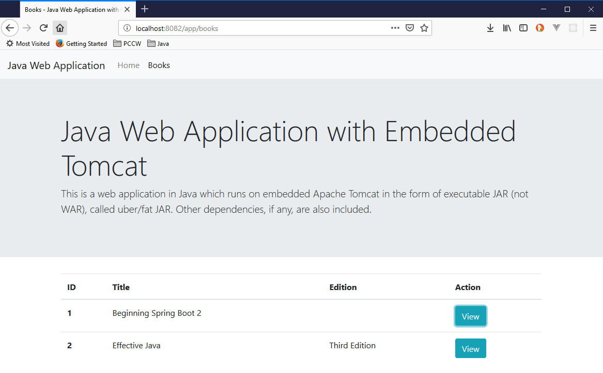
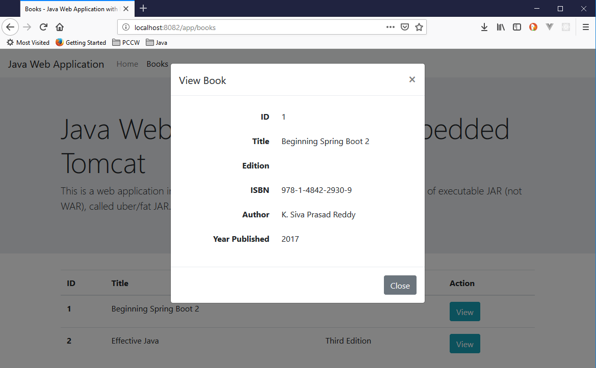

# Java Web Application with Embedded Tomcat

This is a web application in Java with Apache Tomcat embedded to the JAR (not WAR), called fat JAR. Other dependencies are also included in the JAR.

# Running the application
```
git clone https://github.com/julianjupiter/java-web-app-with-embedded-tomcat
cd java-web-app-with-embedded-tomcat
mvn clean package && java -jar ./target/java-web-app-with-embedded-tomcat-1.0.0-SNAPSHOT.jar
```
Open your browser: http://localhost:8080/app

# Screenshots
## Home

## List of Books

## View a Book
